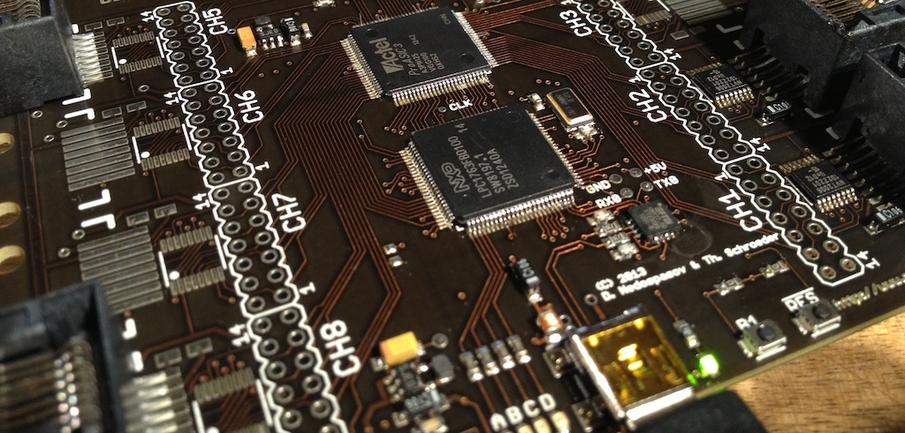

## What is it?

Die Datenkrake (DDK) is an Open Source Hardware USB peripheral for hardware analysis.
The DDK integrates an ARM Cortex M3 microcontroller and a Field Programmable Gate Array (FPGA) into a single fully-programmable platform.
With the FPGA, it is possible to implement additional functionality for the ARM MCU such as additional I/O interfaces.
This makes it possible to process proprietary protocols in real-time.
The well-defined bus interface also makes it substantially easier to write custom HDL modules for the FPGA.
Both the FPGA and ARM can be programmed via the integrated USB-serial interface without the need for additional programming devices.

## Project structure

The DDK consists of both an ARM microcontroller and an FPGA.
The ARM firmware and FPGA bitstream are open source.
The project includes all the necessary tools for flashing the both the ARM and FPGA.
The project is separated into several repositories.

* [ddk-arm](ddk-arm) - Source files for building the ARM firmware.
* [ddk-fpga](ddk-fpga) - Source files for building the FPGA bitstream.
* [ddk-hardware](ddk-hardware) - CAD design files for the PCB layout and schematics.
* [lpcflash](https://github.com/ddk/lpcflash) - Command line tool for flashing LPC ARM microcontrollers.

## Use-cases

Not sure if the DDK is the right project for you?
Check out our list of [use-cases](use-cases).

## Trainings

New to embedded security?
Never done HDL before? 
Want to learn how to use programmable logic for your own applications?
For security applications commercially available tools often just don't cut it.
We teach students how to build custom tools for their field of security analysis.
Consider taking one of [our trainings](trainings).

## Contact

Are you an embedded hardware vendor?
Can't justify the cost of flying your design team to take the training at a security conference?
Rather have a training tailored to the problems that your company faces day to day?
Not a problem!
We do on-site trainings as well!
Just contact us by email: `datenkrake <at> dev.io`.

## Follow us

To stay up to date, follow us on Twitter!
Follow [@DieDatenkrake](http://twitter.com/diedatenkrake) for news on upcoming trainings and conferences where you can get buy a DDK.
While you're at it, follow [@nedos](http://twitter.com/nedos) and [@br3t](http://twitter.com/br3t), the creators of the DDK.
Who the heck are we?
Chekout the [about the authors](authors) page.

## Ordering

Unfortunately we are still in the process of setting up a web shop to sell DDKs.
The easiest way to get a DDK is to take one of our trainings.
However, if you know what you're doing already, you're welcome to buy a device from us directly by talking to us at one of the conferences.
For the rest of you, we hope the wait will be over soon!
Kickstarter is coming to Germany, which will allow us to produce the DDK in volume for supporters of the campaign!
